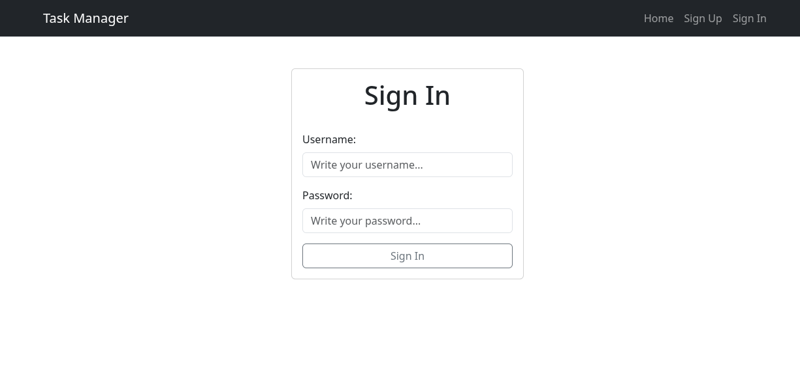
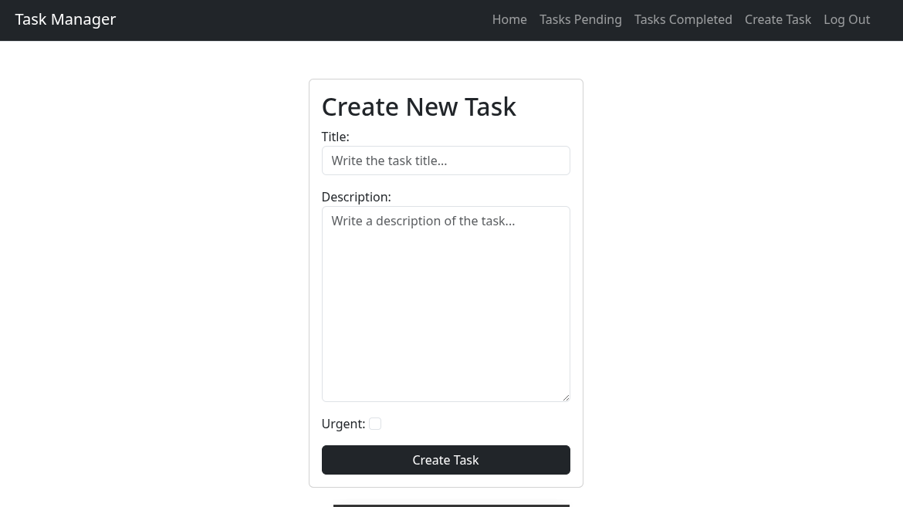
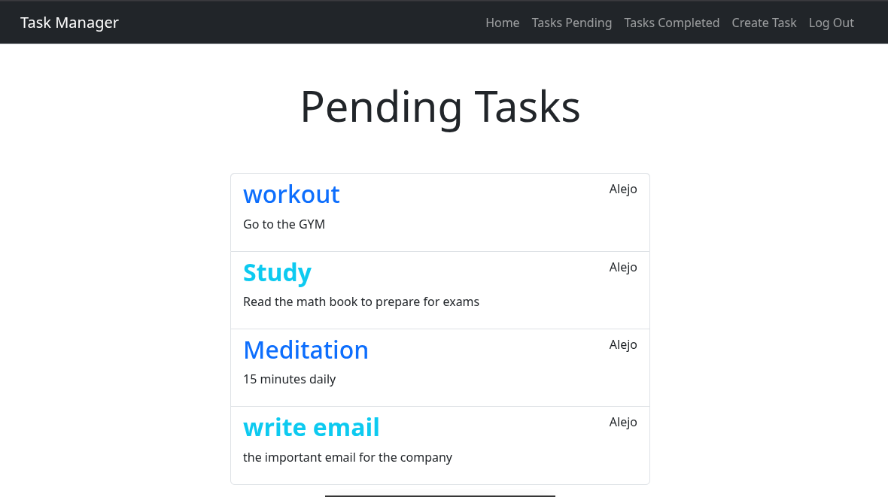

# 📝 Task Manager (Django CRUD Project)

## 📌 Overview

**Task Manager** is a full-stack web application built with **Django** that allows users to create, manage, and track their tasks.
The app includes **user authentication**, task urgency flags, and a clean interface styled with **Bootstrap**.

It supports **pending and completed task views** and demonstrates backend skills with Django’s ORM, forms, and authentication system, combined with a production-ready deploy on **Render**.

🔗 **Live Demo (Render):** [https://task-manager-c7fd.onrender.com/](https://task-manager-c7fd.onrender.com/)

---

## 🚀 Features

* 🔑 **User authentication** (signup, login, logout)
* ➕ **Create tasks** with title, description, and urgency flag
* 📋 **Pending tasks view**
* ✅ **Completed tasks view** (with completion date)
* ✏️ **Update or delete tasks**
* 🎨 Responsive UI styled with **Bootstrap**
* ☁️ **Deployed on Render (Free Tier)** with PostgreSQL

---

## 🛠️ Tech Stack

* **Backend:** Django (Python)
* **Database:** PostgreSQL (Render free tier) / SQLite (local dev)
* **Frontend:** Django Templates + Bootstrap 5
* **Auth:** Django built-in authentication system
* **Deploy:** Render

---

## 📂 Project Structure

```
task_manager/
│── tasks/               # App with models, views, forms, migrations
│── templates/           # HTML templates (Bootstrap integrated)
│── requirements.txt     # Dependencies
│── manage.py            # Django project manager
```

---

## ⚡ Getting Started (Local Development)

### 1. Clone the repository

```bash
git clone https://github.com/HelberthGM/task_manager.git
cd task-manager
```

### 2. Create & activate a virtual environment

```bash
python3 -m venv venv
source venv/bin/activate   # Linux/macOS
venv\Scripts\activate      # Windows
```

### 3. Install dependencies

```bash
pip install -r requirements.txt
```

### 4. Run migrations

```bash
python manage.py migrate
```

### 5. Create a superuser (admin)

```bash
python manage.py createsuperuser
```

### 6. Start the development server

```bash
python manage.py runserver
```

Visit: **[http://127.0.0.1:8000/](http://127.0.0.1:8000/)** 🎉

---

## ☁️ Deploy on Render (Free Tier)

This project is deployed on **Render.com**, a cloud platform with a free tier ideal for portfolio projects.

### Deployment steps:

1. Push your project to GitHub
2. Create a new Web Service on [Render](https://render.com)
3. Connect your GitHub repo
4. Configure:

   * **Build Command:**

     ```bash
     ./build.sh
     ```
   * **Start Command:**

     ```bash
     python -m gunicorn task_manager.asgi:application -k uvicorn.workers.UvicornWorker
     ```
5. Add environment variables:

   * `SECRET_KEY`
   * `DATABASE_URL` (Render provides this when you add a free PostgreSQL instance)
   * `WEB_CONCURRENCY`
6. Deploy 🚀

---

## 📸 Screenshots

### 🔑 Login Page


### 📝 Task Form


### 📋 Pending Tasks


---

## 🎯 Why this project?

This project shows strong backend skills:

* Django CRUD development
* User authentication & authorization
* Bootstrap integration for responsive UI
* PostgreSQL + deploy to production (Render)

Perfect for developing backend development skills. 🌟

---
